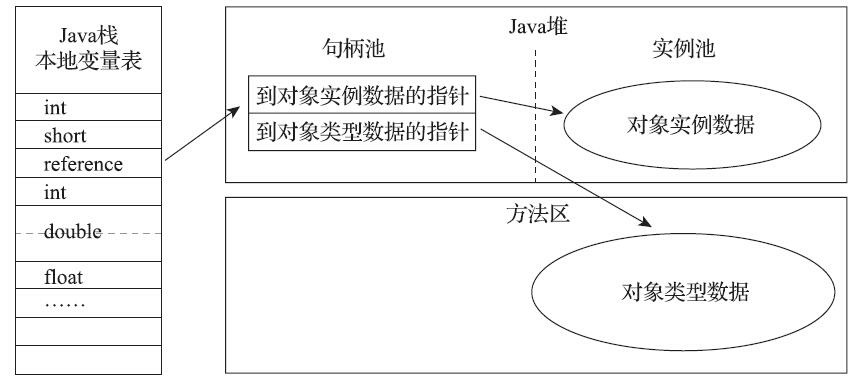
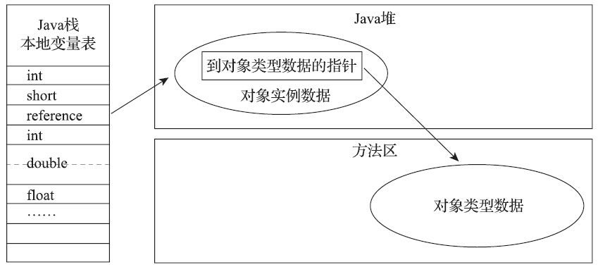

[TOC]
# 深入理解Java虚拟机第三版笔记

## 2.3 HotSpot虚拟机对象探秘

### 2.3.1 对象的创建

1.为对象分配内存空间的方式:

* (1)指针碰撞(Bump The Pointer);
* (2)空闲列表(Free List).

选择哪种分配方式由Java堆是否规整决定，而Java堆是否规整又由所采用的垃圾收集器是否带有空间压缩整理（Compact）的能力决定

2.解决虚拟机创建对象时线程不安全问题的两种方案:

* (1)采用CAS配上失败重试的方式;
* (2)本地线程分配缓冲(Thread Local Allocation Buffer, TLAB)

### 2.3.2 对象的内存布局

在HotSpot虚拟机里，对象在堆内存中的存储布局可以划分为三个部分：

* 对象头（Header）
* 实例数据（Instance Data）
* 对齐填充（Padding）

1.对象头部分包含两类信息

* 第一部分是用于存储对象自身的运行时数据.
  * 如哈希码（HashCode）、GC分代年龄、锁状态标志、线程持有的锁、偏向线程ID、偏向时间戳等，这部分数据的长度在32位和64位的虚拟机（未开启压缩指针）中分别为32个比特和64个比特，官方称它为“Mark Word”.
* 第二部分是类型指针，即对象指向它的类型元数据的指针，Java虚拟机通过这个指针来确定该对象是哪个类的实例.
  * 并不是所有的虚拟机实现都必须在对象数据上保留类型指针，换句话说，查找对象的元数据信息并不一定要经过对象本身.
  * 如果对象是一个Java数组，那在对象头中还必须有一块用于记录数组长度的数据，因为虚拟机可以通过普通Java对象的元数据信息确定Java对象的大小，但是如果数组的长度是不确定的，将无法通过元数据中的信息推断出数组的大小.

2.实例数据部分

* 实例数据部分是对象真正存储的有效信息
  * 在程序代码里面所定义的各种类型的字段内容，无论是从父类继承下来的，还是在子类中定义的字段都必须记录起来;
  * 这部分的存储顺序会受到虚拟机分配策略参数（-XX：FieldsAllocationStyle参数）和字段在Java源码中定义顺序的影响;

3.对齐填充

* 并不是必然存在的，它仅仅起着占位符的作用，由于HotSpot虚拟机的自动内存管理系统要求对象起始地址必须是8字节的整数倍，换句话说就是任何对象的大小都必须是8字节的整数倍，如果对象实例数据部分没有对齐的话，就需要通过对齐填充来补全.

### 2.3.3 对象的访问定位

主流的访问方式主要有两种:

* 使用句柄访问

  

  * 使用句柄来访问的最大好处就是reference中存储的是稳定句柄地址，在对象被移动（垃圾收集时移动对象是非常普遍的行为）时只会改变句柄中的实例数据指针，而reference本身不需要被修改;

* 直接指针访问

  

  * 使用直接指针来访问最大的好处就是速度更快，它节省了一次指针定位的时间开销，由于对象访问在Java中非常频繁，因此这类开销积少成多也是一项极为可观的执行成本.
